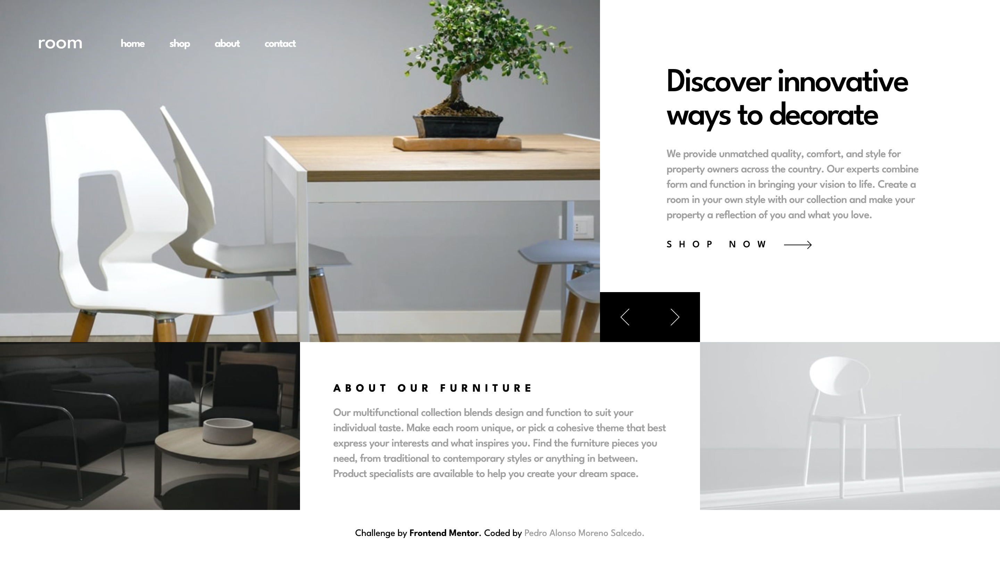
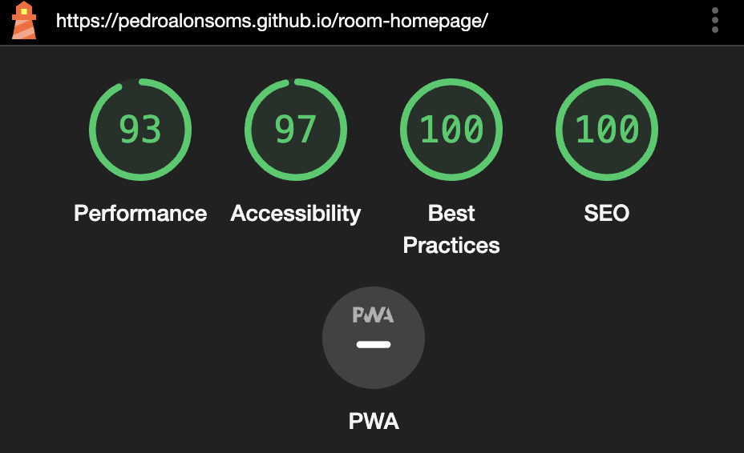

# Frontend Mentor - Room homepage solution

This is a solution to the [Room homepage challenge on Frontend Mentor](https://www.frontendmentor.io/challenges/room-homepage-BtdBY_ENq). Frontend Mentor challenges help you improve your coding skills by building realistic projects.

### Links

- [Live](https://pedroalonsoms.github.io/room-homepage/) on GitHub Pages

### Showcase

#### Desktop preview

### Mobile ligthouse stats

#### Mode: Navigation (Default)

### Built with

- [Astro](https://astro.build/) - Static Site Generator
- [Tailwind](https://tailwindcss.com/) - For styles

### Areas that could be improved

- Accesibility & semantics
- Make it pixel-perfect and color-perfect
- Purge references
- Make sure svgs contain valid properties
- Better image compression without loosing that much quality
- Prevent initial font layout shifts
- Extract navbar in its own component
- Too much horizontal padding on screens over `max-w-2xl`
- Better flex comprehension on the navbar
- Confirm that `logo` tree-shaking is working
- Better navbar design
- Better css specificity comprehension
- Improve duplicate class `group-[[data-open]]:sm:bg-transparent` for specificity reasons
- Better navbar JavaScript implementation
- Remove tailwind treeshaking hack on `body`
- Carrousel accesibility, implement `tabindex`
- Lazy load images to "cache" them
- Change images to `jpg` instead of `webp`?
- Lossles Compress `jpg`?
- Lazy load carrousel images
- Pass image format to `webp`
- Better `picture` `srcset` attributes and responsive images
- Improve carrousel SEO and accesibility
- Consistent margin and padding usage
- Better image handling, use proper `width` and `height` instead of absolute positioning for gettnig them to be the minimum height of the container
- Fix image layout shifting on page load

- Run rests when zooming-in
- Cross-browser testing
- Run this stuff on lighthouse

## Acknowledgments

- Help from Web.dev: https://web.dev/
- Help from W3Schools: https://www.w3schools.com/graphics/svg_polygon.asp
- Help from MDN: https://developer.mozilla.org/en-US/
- Tons of help from StackOverflow: https://stackoverflow.com/
- Kevin Powell's YouTube Channel: https://www.youtube.com/@KevinPowell helped me a lot
- Kevin Powell's Responsive Design Article: https://www.freecodecamp.org/news/taking-the-ri:ght-approach-to-responsive-web-design/
- Adam Wathan's YouTube Channel: https://www.youtube.com/@AdamWathan
- Previous project: https://github.com/pedroalonsoms/sunnyside-agency-landing-page
- RGB to HSL color conversion: https://www.rapidtables.com/convert/color/rgb-to-hsl.html
- How to Scale SVG: https://css-tricks.com/scale-svg/
- SVGOMG - SVGO's Missing GUI: https://jakearchibald.github.io/svgomg/
- Image Color Picker: https://imagecolorpicker.com/en
- WebP converter by TinyIMG: https://tiny-img.com/webp/
- CompressPNG: https://compresspng.com/
- TinyPNG: https://tinypng.com/
- Optimizilla Image Compressor: https://imagecompressor.com/
- W3 ORG: https://www.w3.org/
- Deque University: https://dequeuniversity.com/
- Stack Exchange: https://webmasters.stackexchange.com/
- Typescript Docs: https://www.typescriptlang.org/docs/handbook/jsdoc-supported-types.html
- Compress JPG with the force of an elephant: https://compressjpeg.com/
- Tiny img Webp: https://tiny-img.com/webp/
